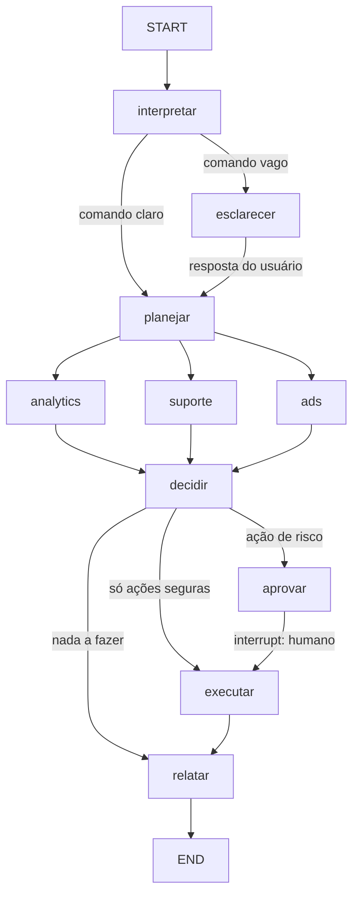

# Agente de IA para operar um ebook na Hotmart

Um agente que recebe **um comando em linguagem natural** e cuida da operação do
produto: analisa desempenho de vendas, responde a caixa de suporte e gerencia as
campanhas do Meta Ads — executando ou recomendando, conforme o nível de
autonomia configurado.

```bash
python -m hotmart_agent "como estão as vendas essa semana?"
python -m hotmart_agent "responde os e-mails do suporte"
python -m hotmart_agent "sobe uma campanha nova se tiver saldo"
python -m hotmart_agent "me dá um resumo geral do produto"
```

Implementado sobre [LangGraph](https://docs.langchain.com/oss/python/langgraph/overview),
com paralelismo entre módulos, checkpoint durável e pausa para aprovação humana
(`interrupt`) nas ações que gastam dinheiro ou falam com o cliente.

---

## 1. Visão geral da solução

O problema real de quem vende um ebook na Hotmart não é falta de dado — é que o
dado está espalhado em três painéis que ninguém abre todo dia (Hotmart, caixa de
e-mail, Gerenciador de Anúncios), e as decisões importantes dependem de cruzar os
três. Reembolso subindo é problema de produto, mas aparece primeiro no suporte.
Campanha que parou de vender pode ser criativo saturado ou checkout fora do ar —
e a diferença muda completamente o que fazer.

O agente resolve isso em três movimentos:

1. **Coleta** os três domínios em paralelo, em uma única passada.
2. **Cruza** os sinais e transforma em uma fila priorizada de ações, com impacto
   financeiro estimado.
3. **Executa** o que está dentro dos limites de segurança e **pede aprovação**
   para o resto — sem nunca gastar dinheiro por conta própria fora do orçamento
   configurado.

### Três decisões de arquitetura que definem o resto

**Números não passam pelo LLM.** Todo o cálculo de KPI, detecção de anomalia,
score de prioridade e decisão de gasto é código determinístico e testado. O
modelo entra em dois pontos apenas: desambiguar um comando confuso e melhorar a
redação. Isso torna a operação auditável ("por que o agente pausou a campanha?"
tem resposta exata) e faz o sistema **funcionar inteiro sem LLM nenhum** — o
caminho de fallback é o caminho principal.

**Autonomia é uma matriz, não um interruptor.** O que o agente pode fazer sozinho
depende do risco da ação cruzado com o nível configurado (L0 a L3) e limitado por
guardrails financeiros que nem o modo autônomo ultrapassa. Rascunhar e-mail é
uma coisa; disparar R$ 300/dia em anúncio é outra.

**Falha parcial é o caso normal, não a exceção.** A API da Meta cai, o token da
Hotmart expira, o IMAP dá timeout. Cada integração tem seu próprio circuit
breaker; a queda de uma reduz o escopo da resposta e marca a execução como
degradada, mas as outras duas frentes seguem trabalhando.

---

## 2. Funcionalidades do agente

### 2.1 Monitorar e analisar o desempenho

Compara a janela atual com a anterior de mesmo tamanho e calcula receita bruta e
líquida, vendas, ticket médio, conversão de checkout e de página, taxa de
reembolso, taxa de chargeback, boletos/PIX pendentes, tráfego, investimento em
mídia e ROAS.

Além da comparação entre janelas, calcula a **tendência interna** (inclinação da
receita diária + volatilidade). A distinção importa: uma queda de 20% na semana
pode ser ruído estatístico; uma inclinação negativa consistente dia após dia é
sintoma estrutural. Reagir ao primeiro caso queima orçamento à toa.

Sinais que o agente emite:

| Código | Gatilho padrão | Por que importa |
|---|---|---|
| `REFUND_RATE_HIGH` | reembolso ≥ 7% (crítico ≥ 12%) | acima de 10% a Hotmart monitora e pode restringir o checkout |
| `CHARGEBACK_RATE_HIGH` | chargeback ≥ 0,5% | acima de 1% há risco de bloqueio pela adquirente |
| `CONVERSION_DROP` | queda ≥ 20% vs. janela anterior | checkout fora do ar, oferta alterada ou tráfego pior |
| `REVENUE_DROP` | queda ≥ 20% | separa sazonalidade de problema estrutural via tendência |
| `TRAFFIC_DROP` | queda ≥ 25% | campanha pausada, verba acabada ou anúncio reprovado |
| `PENDING_PAYMENT_RECOVERY` | ≥ 15% dos pedidos pendentes | régua de lembrete recupera ~1/3 |
| `AFFILIATE_CONCENTRATION` | 1 afiliado ≥ 50% da receita | risco de dependência |
| `SCALE_WINNING_SOURCE` | ROAS do canal ≥ meta | onde colocar mais dinheiro |
| `ORGANIC_CHANNEL_STRONG` | canal orgânico convertendo bem | base para lookalike e ângulo criativo |
| `NO_SALES` | zero vendas na janela | testar a própria compra agora |

O diagnóstico é contextual, não só um limiar. Reembolso alto com maioria dos
pedidos nas primeiras 48h aponta expectativa desalinhada na página de vendas;
distribuído ao longo da garantia aponta conteúdo abaixo da promessa. São
problemas diferentes com correções diferentes, e o agente diz qual é qual.

Volume baixo rebaixa a severidade automaticamente: 2 reembolsos em 8 vendas não
são "uma crise de 25%", são amostra pequena.

### 2.2 Responder e-mails frequentes

Classificação em 11 categorias (acesso, pagamento, reembolso, dúvida de conteúdo,
nota fiscal, técnico, afiliado, parceria, reclamação, spam, outro) por pontuação
de termos ponderada, normalizada sem acento — o cliente escreve "dúvida" e
"duvida".

A confiança é calibrada por duas parcelas: o quanto o vencedor se destaca do
segundo colocado e o quanto de evidência absoluta existe. Categoria única com um
termo fraco não atinge o limiar de envio automático.

Quando as regras ficam abaixo do limiar, o LLM entra como desempate — mas **um
acerto do modelo nunca eleva a confiança acima do limiar de envio automático**.
Se as regras não reconheceram o caso, ele merece olho humano.

Travas absolutas de envio automático, independentes da confiança:

- menção a Procon, advogado, processo, Reclame Aqui, imprensa, LGPD ou chargeback;
- tom hostil ou negativo do cliente;
- categorias reembolso, afiliado, parceria, reclamação e outro;
- limite de e-mails automáticos por execução.

Tudo o que não é enviado vira rascunho na pasta Drafts, com o motivo registrado.
O agente nunca apaga e-mail: marca com label (`agente/respondido`,
`agente/escalado`) para auditoria.

A caixa de entrada também funciona como sensor do produto — ela antecipa em dias
o que vai aparecer no painel da Hotmart:

- muitos e-mails de acesso → e-mail de liberação caindo em spam (checar SPF/DKIM);
- pedidos de reembolso acumulando → o número do painel vai subir;
- dúvidas repetidas sobre o mesmo capítulo → lacuna de conteúdo.

### 2.3 Gerenciar campanhas no Meta Ads

Ordem de operação inegociável: **saldo e status da conta → diagnóstico do que já
roda → plano novo**. Verificar a conta primeiro evita o erro clássico de montar
campanha em conta bloqueada.

A verificação de verba lê `account_status`, `disable_reason`, `balance`,
`spend_cap`, `amount_spent` e `funding_source_details`, e calcula o disponível
real como o mínimo entre saldo pré-pago e teto de gasto restante. Conta
desativada zera o catálogo inteiro e vira alerta crítico com o motivo traduzido.

Diagnóstico por campanha ativa (ignorando as que gastaram menos de um ticket —
julgar campanha com R$ 20 gastos é ler ruído):

- gastou acima de um ticket sem nenhuma venda → pixel ou público errado, pausar;
- ROAS abaixo de 1 → crítico, pausar ou refazer;
- CPA acima de 60% do ticket → trocar criativo antes de mexer em orçamento;
- ROAS acima da meta → escalar em até +30% (preserva a fase de aprendizado);
- objetivo de tráfego com conversão irrisória → objetivo errado para o produto.

Catálogo de campanhas candidatas, pontuado pelo contexto — o que faz o agente
sugerir a campanha certa para o momento em vez de sempre a mesma:

| Blueprint | Sobe quando | Objetivo |
|---|---|---|
| `retarget_checkout_7d` | abandono de checkout alto | `OUTCOME_SALES` |
| `lookalike_purchasers_1` | base de compradores ≥ 100 | `OUTCOME_SALES` |
| `broad_prospecting` | verba folgada e pixel maduro | `OUTCOME_SALES` |
| `lead_magnet_capture` | CPA direto acima do teto | `OUTCOME_LEADS` |
| `reactivation_leads` | muitos pagamentos pendentes | `OUTCOME_SALES` |

Cada plano aprovado precisa caber em **3 dias de veiculação** com o saldo
disponível — campanha que morre no dia 1 nem sai da fase de aprendizado. Todas
nascem `PAUSED` por padrão.

### 2.4 Interpretar comandos

O roteador determinístico extrai intenções, janela temporal ("hoje", "essa
semana", "últimos 45 dias"), modo de operação de mídia (criar/escalar/pausar) e
se o usuário pediu informação ou execução. Um comando com dois objetos ("vê as
vendas e as campanhas") dispara dois módulos; "resumo geral" dispara os três.

Falar de campanha implica verificar saldo — a intenção é adicionada
automaticamente. Nunca se planeja mídia sem antes saber se a conta pode gastar.

Comando vago ("resolve isso") pausa o grafo com uma pergunta objetiva e opções
concretas. Se a segunda resposta também for vaga, o agente assume o briefing
completo em vez de perguntar de novo — perguntar duas vezes trava o usuário.

---

## 3. Arquitetura sugerida

### 3.1 Camadas

```
┌──────────────────────────────────────────────────────────────┐
│  Entrada:  CLI · API · agendador (cron) · webhook · chat     │
└───────────────────────────┬──────────────────────────────────┘
                            ▼
┌──────────────────────────────────────────────────────────────┐
│  ORQUESTRAÇÃO — LangGraph (graph.py)                         │
│  roteia · paraleliza · pausa para humano · retoma            │
└───────────────────────────┬──────────────────────────────────┘
                            ▼
┌──────────────────────────────────────────────────────────────┐
│  DECISÃO (policy.py) — prioridade · autonomia · guardrails   │
└───────────────────────────┬──────────────────────────────────┘
                            ▼
┌──────────────┬──────────────┬────────────────────────────────┐
│  analytics   │   support    │             ads                │
│  KPIs, ten-  │  triagem e   │  saldo, diagnóstico e plano    │
│  dência,     │  resposta    │  de campanha                   │
│  alertas     │              │                                │
│         (lógica pura, determinística, testável)              │
└──────────────┴──────────────┴────────────────────────────────┘
                            ▼
┌──────────────────────────────────────────────────────────────┐
│  INTEGRAÇÃO — Protocol + cliente real + cliente simulado     │
│  retry · backoff · circuit breaker · redação de segredo      │
└───────────────────────────┬──────────────────────────────────┘
                            ▼
        Hotmart API   ·   Meta Marketing API   ·   IMAP/SMTP
```

### 3.2 Módulos

| Arquivo | Responsabilidade |
|---|---|
| `config.py` | produto, thresholds, guardrails, credenciais, autonomia |
| `models.py` | modelos de domínio serializáveis (`Finding`, `Action`, `CampaignPlan`…) |
| `router.py` | comando em linguagem natural → intenções + parâmetros |
| `policy.py` | prioridade, matriz de autonomia, geração e ranqueamento de ações |
| `graph.py` | grafo LangGraph: nós, arestas, aprovação, execução, relatório |
| `state.py` | contrato de estado com reducers para escrita paralela |
| `modules/analytics.py` | KPIs, tendência e sinais de desempenho |
| `modules/support.py` | classificação, templates e regra de envio automático |
| `modules/ads.py` | verba, diagnóstico e catálogo de campanhas |
| `integrations/*` | adaptadores externos + clientes simulados |
| `errors.py` | hierarquia de erros, retry com backoff, circuit breaker |
| `observability.py` | log estruturado e trilha de auditoria |
| `formatting.py` | formatação monetária e percentual em padrão brasileiro |

### 3.3 O grafo



`analytics`, `suporte` e `ads` rodam em paralelo e escrevem `findings` através de
um reducer — a falha de um não impede os outros. O plano de mídia é fechado em
`decidir`, e não em `ads`, porque só depois do fan-in existem ao mesmo tempo os
dados de venda (Hotmart) e o estado da conta (Meta).

### 3.4 Escalabilidade

- **Estado persistido**: trocar `InMemorySaver` por `PostgresSaver` faz o agente
  sobreviver a restart e permite aprovar uma ação horas depois sem refazer a
  coleta.
- **Execução paralela**: os três módulos já rodam concorrentes; adicionar um
  quarto (Google Ads, WhatsApp) é registrar um nó e uma intenção.
- **Multi-produto**: `Settings` é imutável e injetado; um worker por produto
  compartilha o mesmo grafo compilado.
- **Multi-tenant**: `thread_id` isola conversas; as credenciais vêm do
  `Settings`, nunca de estado global.
- **Custo**: o caminho determinístico não consome token. Só o desempate de
  classificação e a revisão de texto chamam o modelo.

### 3.5 Segurança

- Segredos só via variável de ambiente, nunca no estado do grafo nem em log.
  `redact()` mascara `access_token`, `client_secret`, `password` e
  `authorization` recursivamente; `Settings.redacted()` reporta presença, nunca
  valor.
- Guardrails financeiros avaliados **antes** da autonomia: nem L3 estoura o teto.
- Toda ação com efeito externo gera registro de auditoria com timestamp, ator e
  payload redigido, persistido junto ao checkpoint.
- Campanhas nascem pausadas; `dry_run` é o padrão (é preciso `--live` explícito).
- O LLM nunca decide gasto e nunca inventa número: as instruções de revisão
  proíbem alterar valores, e o texto revisado é descartado em caso de falha.

---

## 4. Fluxo de operação

1. **Interpretar** — o comando vira intenções, janela e modo de operação. Baixa
   confiança consulta o LLM; ambiguidade real pausa e pergunta.
2. **Planejar** — decide quais módulos rodam. Falar de campanha implica checar
   saldo.
3. **Coletar e analisar (paralelo)**
   - `analytics`: busca a janela atual e a anterior na Hotmart, calcula KPIs e
     emite sinais.
   - `suporte`: lê os não lidos, classifica, gera resposta e decide envio
     automático × rascunho.
   - `ads`: lê status e saldo da conta, depois os insights das campanhas ativas.
4. **Decidir** — junta os sinais, ordena por gravidade e prioridade, fecha o
   plano de mídia com os dados dos dois lados e converte tudo em ações
   ranqueadas, cada uma com seu modo de execução resolvido.
5. **Aprovar** — se houver ação de risco, o grafo pausa (`interrupt`) e devolve a
   lista com custo, impacto esperado e justificativa. O estado fica no
   checkpoint: a resposta pode vir minutos ou horas depois.
6. **Executar** — roda o que é automático e o que foi aprovado. Cada falha é
   isolada: uma ação que quebra não impede as outras.
7. **Relatar** — relatório determinístico em markdown, opcionalmente revisado
   pelo LLM sem alterar números, terminando sempre no próximo passo concreto.

---

## 5. Integrações necessárias

| Sistema | Uso | Credenciais |
|---|---|---|
| **Hotmart Payments API** | histórico de vendas, reembolso, reenvio de acesso | `HOTMART_CLIENT_ID`, `HOTMART_CLIENT_SECRET` |
| **Meta Marketing API** (v21.0) | saldo, insights, criação de campanha | `META_ACCESS_TOKEN`, `META_AD_ACCOUNT_ID`, `META_PIXEL_ID`, `META_PAGE_ID` |
| **IMAP + SMTP** | leitura e resposta do suporte | `IMAP_*`, `SMTP_*` |
| **LLM** (opcional) | desempate de roteamento e revisão de texto | `ANTHROPIC_API_KEY` |
| **Checkpointer** | estado durável entre execuções | Postgres/SQLite (padrão: memória) |

Endpoints usados:

- Hotmart: `POST /security/oauth/token` (client credentials, token cacheado ~24h)
  e `GET /payments/api/v1/sales/history` com paginação por `page_token`.
- Meta: `GET /act_<id>?fields=account_status,disable_reason,balance,spend_cap,amount_spent,funding_source_details`,
  `GET /act_<id>/insights` (nível campanha) e `POST /act_<id>/campaigns` +
  `/adsets`.

Cada integração expõe um `Protocol` e tem um cliente simulado equivalente. Sem
credencial ou em `dry_run`, o `build_*` devolve o simulado — o agente roda
completo, com dados sintéticos coerentes, sem tocar em nada externo.

**Integrações que valem a pena adicionar depois**: WhatsApp Business API
(recuperação de boleto tem taxa de resposta muito maior que e-mail), Google
Analytics 4 (sessões reais de checkout, hoje estimadas), e webhook de postback da
Hotmart (reagir a evento em vez de fazer polling).

---

## 6. Regras de decisão

### 6.1 Prioridade

```
score = peso_gravidade × (0,5 + impacto_normalizado) × confiança ÷ esforço
```

O impacto entra em raiz quadrada sobre uma referência de 10 tickets, para que um
número grande isolado não domine a fila. O `+0,5` garante que um sinal crítico
sem valor estimado ainda pontue.

**A gravidade domina a ordenação**: a fila é agrupada por faixa (crítico →
alerta → oportunidade → informativo) e o score ordena dentro da faixa. É
deliberado — uma oportunidade de R$ 5.000 não pode passar na frente de um risco
de bloqueio do checkout. Perder receita é recuperável; perder o checkout, não.

Entre ações, contato com cliente irritado corre na frente de otimização de mídia:
escalonamento ganha +1,5 de prioridade, resposta de suporte +0,6.

### 6.2 Autonomia × risco

| Ação | Risco | L0 observar | L1 recomendar | L2 aprovar (padrão) | L3 autônomo |
|---|---|---|---|---|---|
| Relatar | nenhum | ✅ | ✅ | ✅ | ✅ |
| Rascunhar e-mail | baixo | 📋 | 📋 | ✅ | ✅ |
| Pausar campanha | baixo | 📋 | 📋 | ✅ | ✅ |
| Escalar para humano | baixo | 📋 | 📋 | ✅ | ✅ |
| Enviar e-mail | médio | 📋 | 📋 | ⏸ | ✅ |
| Alterar orçamento | alto | 📋 | 📋 | ⏸ | ✅ |
| Criar campanha | alto | 📋 | 📋 | ⏸ | ✅ |
| Reembolsar | alto | 📋 | 📋 | ⏸ | ✅ |

✅ executa · ⏸ pede aprovação · 📋 só recomenda

O risco segue a reversibilidade. Pausar campanha é reversível em um clique;
e-mail enviado não volta; criar campanha gasta dinheiro.

### 6.3 Guardrails (avaliados antes da autonomia)

| Limite | Padrão | Efeito |
|---|---|---|
| `max_daily_budget_brl` | R$ 150 | acima disso a ação é **bloqueada**, mesmo em L3 |
| `max_new_campaigns_per_run` | 2 | evita pulverizar verba |
| `max_budget_increase_pct` | 30% | preserva a fase de aprendizado do algoritmo |
| `min_account_balance_brl` | R$ 50 | abaixo disso, alerta antes de planejar |
| `min_roas_to_scale` | 2,0 | só escala o que já se paga |
| `max_auto_emails_per_run` | 25 | limita o estrago de um erro de classificação |
| `auto_reply_min_confidence` | 80% | abaixo disso, rascunho |
| `refund_auto_approve_max_brl` | R$ 300 | acima disso, sempre aprovação |
| `new_campaigns_start_paused` | sim | humano liga |

### 6.4 Envio automático de e-mail

```
tem sinal jurídico/chargeback?      → escalar para humano
tom hostil ou negativo?             → rascunho
categoria fora da lista automática? → rascunho
confiança < 80%?                    → rascunho
estourou o limite da execução?      → rascunho
                          senão     → responder e marcar como tratado
```

### 6.5 Seleção de campanha

```
conta inativa?                    → nenhum plano, alerta crítico
orçamento acima do teto?          → cortar no teto
não cabe 3 dias com o saldo?      → fora, com o motivo explicado
já atingiu o limite da execução?  → fora
pontuação ≤ 0 no contexto?        → fora
                        senão     → aprovar, pausada, e somar ao orçamento usado
```

---

## 7. Tratamento de erros e casos extremos

### 7.1 Falha de integração

| Situação | Comportamento |
|---|---|
| 5xx ou timeout | até 3 tentativas com backoff exponencial + jitter |
| 429 | respeita o `Retry-After` do cabeçalho |
| 401/403 | **não** retenta — repetir credencial inválida só queima quota |
| falhas consecutivas | circuit breaker abre por 60s (half-open deixa passar 1 teste) |
| serviço fora do ar | módulo devolve resultado degradado; os outros continuam |

O relatório abre com uma seção **⚠ Execução parcial** listando o que não pôde ser
verificado. O agente nunca finge que analisou o que não conseguiu ler.

### 7.2 Casos extremos tratados

| Caso | Tratamento |
|---|---|
| Volume baixo de vendas | severidade rebaixada a informativo — sem falso alarme estatístico |
| Zero vendas na janela | crítico com ação imediata: testar a própria compra |
| Divisão por zero (0 sessões, 0 unidades) | `_safe_div` em toda razão |
| Janela anterior vazia | variação vira `—`, não `+∞` |
| Série muito curta para tendência | devolve `insuficiente` em vez de extrapolar |
| Conta de anúncios desativada | zera o catálogo e traduz o `disable_reason` |
| Pós-pago sem teto de gasto | disponível = infinito, mas o guardrail diário ainda vale |
| Campanha com gasto irrisório | não é julgada — dado insuficiente |
| Cliente hostil ou com risco jurídico | escalonamento, nunca resposta automática |
| E-mail sem termo conhecido | categoria "outro", vai para revisão |
| Header de e-mail malformado | decodificação tolerante; um e-mail ruim não derruba o lote |
| Comando vago duas vezes | assume o briefing em vez de perguntar de novo |
| LLM indisponível ou com erro | cai para as regras e registra o motivo |
| LLM devolve JSON inválido | descartado; nenhuma exceção de LLM sobe para o grafo |
| Resposta de aprovação ambígua | o que não foi aprovado explicitamente é rejeitado |
| Aprovação demorada | estado no checkpoint; retomável a qualquer momento |
| Ação individual falha na execução | isolada como `failed`, as demais continuam |

### 7.3 Princípios de falha

- **Falha fechada em dinheiro**: na dúvida sobre gasto, não gasta.
- **Falha aberta em informação**: na dúvida sobre um número, mostra o que tem e
  sinaliza o que faltou.
- **Silêncio nunca é resposta**: e-mail não respondido vira rascunho com o motivo
  registrado, não desaparece.

---

## 8. Exemplos de comandos e respostas esperadas

### 8.1 Análise de desempenho

```
$ python -m hotmart_agent "como estão as vendas essa semana?"
```

```markdown
# Ebook — resultado da execução

## 1. Desempenho (2026-07-21 a 2026-07-28)
| Indicador | Atual | Anterior | Variação |
|---|---:|---:|---:|
| Receita bruta | R$ 8.342,00 | R$ 10.088,00 | -17,3% |
| Vendas aprovadas | 86 | 104 | -17,3% |
| Conversão do checkout | 18,49% | 21,76% | -15,0% |
| Taxa de reembolso | 10,47% | 4,81% | +117,7% |
| Taxa de chargeback | 1,16% | 0,96% | +20,9% |
| ROAS geral | 3,46x | 3,46x | +0,0% |

## 2. Sinais de alerta

**🔴 Chargeback em 1,16%**
- 1 contestações. Acima de 1% há risco real de bloqueio do meio de pagamento
  pela adquirente.
- Ação sugerida: Responder solicitações de reembolso em até 24h — reembolso
  voluntário custa menos que contestação — e revisar o nome que aparece na
  fatura do cartão.
- Impacto estimado: R$ 349,59/mês

**🟡 Taxa de reembolso em 10,5%**
- 9 reembolsos em 86 vendas. Maioria dos pedidos ocorre nas primeiras 48h, o que
  aponta para expectativa desalinhada na página de vendas ou falha na entrega.
- Ação sugerida: Revisar as 3 primeiras telas da página de vendas e o e-mail de
  boas-vindas; incluir um vídeo de 60s de onboarding no Club.
- Impacto estimado: R$ 3.146,29/mês

## 3. Próximo passo
Prioridade agora: chargeback em 1,16% — Responder solicitações de reembolso em
até 24h e revisar o nome que aparece na fatura do cartão.
```

### 8.2 Comando ambíguo

```
$ python -m hotmart_agent "resolve isso"

❓ Posso agir em três frentes: (1) analisar o desempenho das vendas,
   (2) responder a caixa de entrada do suporte ou (3) revisar as campanhas do
   Meta Ads. Qual delas você quer agora — ou quer o resumo geral das três?
   • analisar desempenho das vendas
   • responder e-mails do suporte
   • revisar campanhas do Meta Ads
   • resumo geral (as três frentes)

> as campanhas
```

O agente retoma do ponto exato, sem refazer nada.

### 8.3 Mídia paga com verificação de verba

```
$ python -m hotmart_agent "sobe uma campanha nova se tiver saldo"
```

```markdown
## 1. Meta Ads
- Conta ativa — saldo disponível: R$ 420,00
- Plano: **[VENDAS] Remarketing checkout 7d — Ebook** — R$ 19,40/dia,
  público: Quem iniciou o checkout nos últimos 7 dias e não comprou.
  Abandono de checkout em 82%: público quente, volume baixo e CPA
  historicamente o menor do funil.
- Plano: **[VENDAS] Reativação de leads — Ebook** — R$ 15,00/dia,
  público: Leads dos últimos 60 dias que não compraram.
  15 pagamentos pendentes indicam intenção não concluída na base.
  - _'[VENDAS] Lookalike 1% compradores' fora: limite de 2 campanhas novas por execução_
```

```
⚠ Estas ações têm risco financeiro ou impacto externo e precisam da sua confirmação.
   [camp-37f65da1] Criar campanha: [VENDAS] Remarketing checkout 7d — R$ 19,40/dia
        motivo: Abandono de checkout em 82%: público quente, volume baixo e CPA
                historicamente o menor do funil.
   [camp-111c98d5] Criar campanha: [VENDAS] Reativação de leads — R$ 15,00/dia
        motivo: 15 pagamentos pendentes indicam intenção não concluída na base.

Responda: 'aprovar tudo', 'rejeitar tudo' ou os ids separados por espaço
> camp-37f65da1
```

Aprova só a primeira; a segunda é registrada como `rejected`. As campanhas são
criadas **pausadas**.

### 8.4 Conta bloqueada

```
$ python -m hotmart_agent "cria campanha de remarketing"
```

```markdown
**🔴 Conta de anúncios inativa**
- Status 2: conta desativada por problema de pagamento (IP_CENTRAL). Nenhuma
  campanha pode ser criada ou veiculada até a regularização.
- Ação sugerida: Abrir a Central de Contas do Meta Business, revisar a pendência
  e solicitar revisão. Enquanto isso, redirecionar esforço para canais orgânicos
  e lista de e-mail.
```

Nenhum plano é proposto e nenhuma chamada de criação é feita.

### 8.5 Suporte

```
$ python -m hotmart_agent "responde os e-mails do suporte"
```

```markdown
## 1. Suporte
- 8 e-mail(s) triados: 4 com resposta automática, 4 para revisão humana.
  - `joao.pereira@example.com` — reembolso (confiança 95%): categoria 'reembolso'
    exige revisão humana
  - `ana.martins@example.com` — afiliado (confiança 95%): categoria 'afiliado'
    exige revisão humana
  - `lucas.ferreira@example.com` — reclamacao (confiança 86%): sinal de
    escalonamento (chargeback, juridico, reputacao)
  - `promo@marketingblast.example` — spam (confiança 95%): spam: arquivar sem resposta

## 2. Próximo passo
Prioridade agora: 1 e-mail(s) com risco jurídico ou de reputação — Responder
pessoalmente e resolver na primeira interação.
```

### 8.6 Operação autônoma agendada

```bash
# todo dia às 8h, executa dentro dos guardrails e reporta
0 8 * * *  HOTMART_AGENT_AUTONOMY=L3 python -m hotmart_agent --live \
             "briefing diário do produto" >> /var/log/hotmart-agent.log
```

---

## Instalação e uso

```bash
cd apps/hotmart-ebook-agent
uv sync --all-extras
cp .env.example .env      # preencha o que tiver; o que faltar roda simulado

make demo                 # execução completa com dados sintéticos
make test                 # 120 testes
make lint
```

Sem nenhuma credencial o agente roda inteiro com dados sintéticos coerentes —
serve para avaliar as regras de decisão antes de conectar qualquer API.

### Como biblioteca

```python
from hotmart_agent import Settings, build_graph
from hotmart_agent.config import Autonomy, Product

settings = Settings(
    product=Product(name="Ebook X", price_brl=147.0, hotmart_product_id="123456"),
    autonomy=Autonomy.APPROVE,
    dry_run=False,
)
graph = build_graph(settings)
state = graph.invoke(
    {"command": "como estão as vendas?"},
    config={"configurable": {"thread_id": "op-1"}},
)
print(state["report"])
```

### Estado durável em produção

```python
from langgraph.checkpoint.postgres import PostgresSaver

with PostgresSaver.from_conn_string(DB_URI) as checkpointer:
    checkpointer.setup()
    graph = build_graph(settings, checkpointer=checkpointer)
```

---

## Limitações conhecidas

- **Sessões de checkout são estimadas** quando não há analytics externo — a
  Payments API não expõe esse dado. Integrar GA4 ou o pixel resolve.
- **Públicos personalizados usam identificadores simbólicos** nos
  `audience_spec`; em produção é preciso resolver os IDs reais via
  `/customaudiences` antes de criar o conjunto.
- **Criativos não são gerados**: o agente define ângulo e público, mas a peça
  ainda é produzida fora.
- **Reembolso via API** depende de o produtor ter a permissão habilitada na
  Hotmart; sem ela, a ação vira escalonamento.
- **Recuperação de boleto** é proposta como sinal, mas o disparo da régua depende
  de uma ferramenta de e-mail marketing ainda não integrada.
